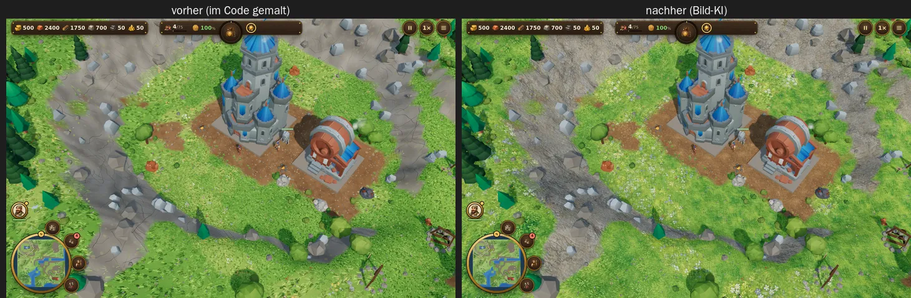
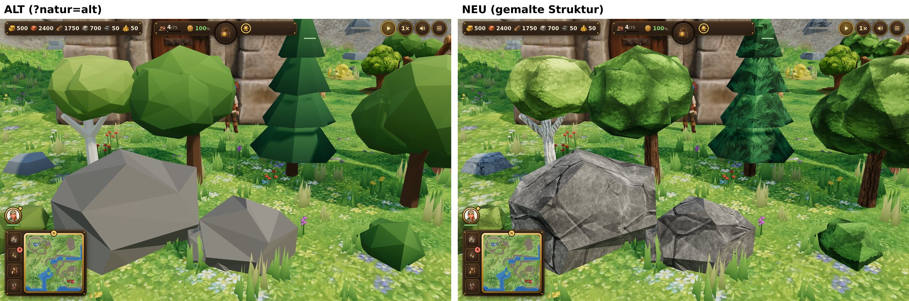

# Bodentexturen

Der Boden besteht aus sechs gemalten, nahtlos kachelbaren Texturen: Gras, Wiese, Erde, Sand, Fels und Schnee.
Sie entstehen per Bild-KI, sind auf die Farbwelt des Spiels angeglichen und liegen als Bilddateien vor.
Fehlt eine Datei, malt das Spiel die Art wie früher im Code (`src/render/textures.js`).



## Im Spiel

| Was | Wo |
|---|---|
| Dateien | `public/textures/ground/<art>.webp` (1024 px), `<art>-512.webp` (512 px) |
| Laden | `loadAssets()` lädt sie vor dem Spielstart mit (`loadGroundImages`), nur die Größe der Grafikstufe: hoch 1024, mittel und niedrig 512 (≈ 1,3 MB bzw. 0,4 MB) |
| Mischen | Gelände-Shader in `src/render/terrain.js` wie bisher: Gewichte je Ecke, helle Stellen setzen sich durch, Fels an Klippen von drei Seiten projiziert, großräumige Farbvariation |
| Kachelung | eine Textur deckt 6 Kacheln ab (Fels 9); ab Stufe „mittel“ zweimal gegeneinander gedreht abgetastet gegen sichtbare Wiederholung |
| Rückfall | ohne Datei (oder offline ohne Cache) die im Code gemalte Textur; `texture.userData.painted` zeigt, woher sie kommt |
| Gebäude | ändern die Bodenfarbe nicht: Der Bauplatz wird nur eingeebnet, der Untergrund bleibt, wie er war (Wiese, Sand, Schnee). Gebäude mit eigener Bodenplatte bringen sie im Modell mit. Gras und Blumen auf und direkt neben der Grundfläche werden ausgeblendet |
| Offline | nicht vorab im Cache der PWA (je Gerät nur eine Größe), sondern beim ersten Laden (`textures`) |

## Neue Texturen erzeugen

```bash
node scripts/asset-gen/ground.mjs gen all                          # je Art ein Kandidat (Seedream 5.0 Flash, 1K)
node scripts/asset-gen/ground.mjs gen grass --model openai/gpt-image-2 --n 2
node scripts/asset-gen/ground.mjs sheet                            # Übersicht, je Kandidat 2×2 gekachelt
node scripts/asset-gen/ground.mjs use grass 2-gpt-image-2.webp     # übernehmen → public/textures/ground/
```

1. **Erzeugen** (`gen`): Prompt = gemeinsamer Stil (`GROUND_STYLE`: von oben, gemalt wie ein warmer Animationsfilm,
   gleichmäßiges Licht, keine Schatten, kein Rand, kein Raster) plus Inhalt je Art (`GROUND_KINDS`). Kandidaten landen
   unter `assets-src/ground/<art>/<nr>-<modell>.webp`, Prompt, Modell und Kosten in `assets-src/ground/ground.json`.
2. **Auswählen** (`sheet`): `assets-src/ground/candidates.webp` zeigt jeden Kandidaten 2×2 gekachelt. Gut sind
   gleichmäßige Bilder ohne einzelne auffällige Formen (die wiederholen sich sichtbar) und ohne dunklen Rand.
3. **Übernehmen** (`use`):
   - 2 % Rand abschneiden (`--crop`).
   - Mittlere Farbe auf die Farbwelt des Spiels schieben (`GROUND_TARGETS`, gemessen an den früheren, im Code
     gemalten Texturen). Die gemalten Hell-Dunkel-Unterschiede bleiben dabei erhalten; abschalten mit `--keep-colors`.
   - Nahtlos machen (`scripts/asset-gen/groundtex.mjs`).
   - Als WebP in 1024 und 512 px schreiben.

**Nahtlos:** Bildmodelle liefern selten von selbst kachelbare Bilder. Das Bild wird erst waagrecht, dann senkrecht
mit einer um die halbe Kante verschobenen Kopie gemischt. Am Rand zählt nur die Kopie, deren Inhalt dort über den Rand
hinweg stetig ist, in der Mitte nur das Original. In der Übergangszone (22 % der Kante) setzt sich das Hellere durch,
damit kein gleichmäßiger Doppelbelichtungs-Streifen entsteht.

**Modelle und Kosten** (OpenRouter, Bild-Schnittstelle `/api/v1/images`, 1024 px):

| Modell | Kosten je Bild | Eindruck |
|---|---|---|
| `openai/gpt-image-2` | 0,007–0,014 $ | malerisch, satt (wird angeglichen); gewählt für Gras, Wiese, Erde, Fels, Schnee |
| `bytedance-seed/seedream-5-0-flash` | 0,018 $ | weicher, blasser, teils mit dunklem Rand; gewählt für Sand |
| `google/gemini-3-pro-image` | – | brach in der Cloud-Umgebung ab (Antwort nach > 30 s) |

Der erste Satz hat 0,18 $ gekostet (12 Kandidaten).

## Naturtexturen (Bäume, Büsche, Felsen)

Die prozeduralen Bäume, Büsche und Felsbrocken (`src/render/nature.js`) bekommen gemalte Struktur, ohne ein
Dreieck mehr: vier eigene nahtlose Texturen, triplanar auf die Formen gelegt.



Weitere Vergleiche (Desktop und Handy, nah/mittel/Spielhöhe): `assets-src/previews/natur-texturen-*.jpg`.

| Art | Datei | Liegt auf | Wiederholung |
|---|---|---|---|
| Laub (`leaves`) | `public/textures/nature/leaves-512.webp` | Kronen der Laubbäume und Birken, Büsche | 0,8 je Kachel (≈ 5 Blattbüschel je Krone), Büsche 0,95 |
| Nadeln (`needles`) | `needles-512.webp` | Nadelbäume (auch KayKit-Kiefern) | 0,65 |
| Rinde (`bark`) | `bark-512.webp` | Stämme und Äste (Birke: helle Rinde mit dunklen Rissen) | 3× bzw. 2× feiner als die Krone |
| Fels (`boulder`) | `boulder-512.webp` | Felsbrocken, Kiesel, KayKit-Felsen (schwächer, sie haben eine eigene Textur) | 1,0 bzw. 0,9 |

Erzeugt mit derselben Pipeline (`ground.mjs` kennt die Naturarten, eigener Stil `NATURE_STYLE`: Seitenansicht,
grobe gemalte Formen mit Licht und Schatten statt Rauschen):

```bash
node scripts/asset-gen/ground.mjs gen nature --n 2          # je Art 2 Kandidaten (Seedream 5.0 Flash)
node scripts/asset-gen/ground.mjs sheet nature              # → assets-src/nature/candidates.webp
node scripts/asset-gen/ground.mjs use leaves 1-seedream-5-0-flash.webp   # → public/textures/nature/
```

Kandidaten, Prompts und Kosten: `assets-src/nature/` (`nature.json`). 10 Bilder, 0,18 $ (Nadeln brauchten einen
zweiten Anlauf: der erste Prompt ergab kleine ganze Tannen). Gewählt: Laub 1, Nadeln 3, Rinde 1, Fels 1.

**Im Spiel** (`src/render/naturetex.js`, Shader in `natureMaterial`):
- Nur die Hell-Dunkel-Struktur zählt. Je Art wird die Helligkeit auf Mittelwert 0,5 und gleiche Streuung
  normiert (`normalizedLuminance`) – die Kronen werden im Mittel weder heller noch dunkler, der Farbton und die
  Farbvielfalt bleiben die der Vertexfarben. Dazu ein kleiner Farbakzent: Lichter etwas wärmer, Schatten kühler.
- Zwei Arten teilen sich eine Textur (R = Krone/Fels, G = Rinde, `packChannels`): 3 Texturzugriffe je Pixel
  (triplanar) für Krone und Stamm zusammen. Welcher Kanal gilt, entscheidet die Vertexfarbe: Rot über Grün
  ist Stamm (braun, Birke weißlich), sonst Krone.
- Geladen vor dem Spielstart wie die Bodentexturen, immer die 512er-Fassung (≈ 0,3 MB; die 1024er bleiben als
  Vorlage). Fehlt ein Bild, bleibt das Objekt ohne Struktur.
- Stufe „niedrig“ (Handy): aus – nichts geladen, Shader ohne Struktur. Vergleich im Spiel: `?nature=off`.
- Offline: Cache `textures` (beim ersten Laden, wie die Bodentexturen).

## Ideen für später

- Gras-Büschel und Blumen (3D) in den Farben der neuen Texturen, unten in Bodenfarbe (wachsen aus dem Boden heraus).
- Eigene Textur für Wege und Waldboden; Herbst als eigene Wiesen-Textur statt Tönung.
