# Kampagne „Krone aus Eis“

Story-Vorgabe vom 4. Okt. 2026 (Julian Dorn) und ihre Umsetzung mit Siedler-5-Mechanik. Grundsatz: **nur
Mechanik aus dem Grundspiel**; fehlt etwas, wird die Geschichte angepasst oder die Mechanik des Originals
nachgebaut, nie eine eigene erfunden. Missionsdateien: `src/sim/missions/campaign/c1-…c6-*.js`,
Bausteine: [Missionen](MISSIONEN.md).

## Welt und Figuren (Kurzfassung)

Das Kronland hat keinen König mehr: König Edrian ertrank in einem Sturm über dem Thronsee, die Krone zerbrach
in fünf Zacken. Malvor, Statthalter von Hagenfurt, hat Hrimgars altes Wetterwerk wieder angeworfen – seitdem
herrscht Winter, und nur er hat Korn. Nelia, Tochter eines Leibeigenen aus Lindgrund, findet die erste Zacke.
Der Händler Orrin erfindet daraus die „verlorene Prinzessin“; die Lüge wird nie aufgelöst.

| Figur | Rolle | Im Spiel |
|---|---|---|
| Nelia | Heldin | alle Missionen |
| Orrin | Händler, Mentor, Kauf-Optionen | Missionen 1–6, im Finale verwundet (feste Szene), stirbt im Abspann |
| Taran | Malvors Hauptmann, läuft über | Gegner in 4 und 5 (Mitte), dann spielbar |
| Malvor | Endgegner | Sprecher; Held des Computergegners in Mission 6 |
| Nebenfiguren | Dorfälteste, Bergmeister, Herold, Kaufmann, Räuberhauptmann, Gelehrte … | namenlos (`speakers.js`) |

## Helden und Fähigkeiten

Mechanik nach dem Vorbild der Helden aus Siedler 5, Namen eigen (Werte: [Spielregeln](SPIELREGELN.md)).
Die alten Helden (Bertram, Hedda, Gerold, Falk, Morla) sind entfernt – Figuren und Fähigkeitsnamen lagen zu
nah am Original.

| Held | Fähigkeit 1 | Fähigkeit 2 | Vorbild |
|---|---|---|---|
| Nelia | Weitblick: deckt ein großes Gebiet auf | Mut machen: Angriff naher Truppen ×2 | Falke des Kundschafters, Aura der Stärke |
| Orrin | Bestechen: feindliche Truppe läuft gegen Taler über | Wundsalbe: heilt nahe Truppen | Überzeugung des Priesters, Heilen |
| Taran | Schildstoß: Rundumschlag | Einschüchtern: Feinde fliehen kurz | Wirbelschlag, Einheiten vertreiben |
| Malvor | Feldgeschütz: Geschütz mit 4 Schuss | Fußangeln: Falle | Selbstschuss-Kanone, Falle |

- „Mut machen“ ohne Motivationsteil – die Aura im Original stärkt nur den Angriff.
- „Feilschen“ (bessere Marktkurse) gibt es im Original nicht und entfällt; Orrin hat stattdessen die Wundsalbe.
- Taran hat nicht die Stärke-Aura (die ist Nelias), sondern Einschüchtern.
- **Figuren:** Konzeptbögen in `assets-src/characters/<hero>/` (Prompts: `hero-prompts.json`, Stil:
  `style-reference-prompt.md`, Modell `openai/gpt-5.4-image-2`). Im Spiel stehen bis zu den eigenen 3D-Figuren
  Platzhalter aus dem KayKit-Paket (`public/models/characters/manifest.json`, Rollen `hero.<id>`). Nelia trägt
  einen Kapuzenumhang in Spielerfarbe, damit sie sich von oben von den Leibeigenen abhebt.

## Story → Mechanik

| Vorgabe | Umsetzung |
|---|---|
| Nahrung, Korn, Kornspeicher | Es gibt keinen Nahrungsrohstoff (wie im Original): Höfe versorgen Arbeiter direkt. Ziele heißen „Bett und Essen für Arbeiter“, „Bauernhöfe bauen“, „Höfe schützen“; Korn bleibt Erzählung. |
| Kronenzacken, Baupläne | Missionsmerker (`flag`), keine Anzeige, kein Inventar – wie im Original. |
| Kaufen oder Kämpfen | Tribute (Angebote) wie im Original: zwei Angebote einer Gruppe schließen einander aus. |
| Neutrale/verbündete Dörfer | Diplomatie feindlich/neutral/verbündet, per Aktion änderbar; Dörfer als Spielerplätze ohne Burg. |
| Mit Figuren reden | Gesprächsfiguren mit Ausrufezeichen, bestimmter Held spricht sie an. |
| Taran wechselt die Seite | Kein Seitenwechsel einer Figur: Taran wird beim Gegner entfernt und beim Spieler neu eingesetzt (Mission 5). |
| Orrins Tod | Er wird beim Sturm übers Eis aus dem Spiel genommen (feste Szene), stirbt im Abspann. |
| Wetterturm, Tauwetter | Wetterkraftwerk (Alchimist: Wettervorhersage → Meteorologie); bei Tauwetter ertrinkt, wer auf dem Eis steht. Malvor hat in Mission 6 ein eigenes Kraftwerk und dieselben Regeln (Ladung, Wartezeit). |
| Söldner | Tribut „Söldner anheuern“ (Truppen erscheinen sofort), kein Wirtshaus. |

## Die sechs Karten

| # | Karte | Akt | Wetter | Zacke | Helden | Ziele (Hauptziele, Nebenziel) |
|---|---|---|---|---|---|---|
| 1 | Lindgrund | Winter | Winter | 1 | Nelia, Orrin | Nelia zur alten Wurzel (Fund, Orrins Lüge), 2 Wohnhäuser, 2 Höfe, 6 Arbeiter, Eintreiber vertreiben; *Orrin gewinnt das Nachbardorf* |
| 2 | Beaucroix | Winter | Winter | 2 | Nelia, Orrin | 3 Höfe, Marktplatz, ein Tausch, Zacke freikaufen **oder** Räuberlager stürmen; *Lehmschuld liefern → Rabatt* |
| 3 | Das Wetterwerk | Winter | Winter → Sommer | – | Nelia, Orrin + Trupp | ohne Burg ins Tal: Tor (stark bewacht) **oder** zugefrorener Fluss durch die Schlucht (kleiner Posten, besiegen oder mit Orrin bestechen); Wetterwerk auf der Insel zerstören, danach in 60 s auf festen Talboden; Baupläne in den Ruinen; *Gefangene befreien* |
| 4 | Eisenhain | Krieg | wechselnd | 3 | Nelia, Orrin | Belagerung brechen (Taran zieht sich geschlagen zurück), Eisen- und Schwefelgrube, Bergmeister; Söldner **oder** Leibeigene; *4 eigene Truppen* |
| 5 | Morvale | Krieg | wechselnd | 4 | Nelia, Orrin, ab Mitte Taran | Herold enthüllt die Lüge, Dörfer neutral, Taran läuft über; Höfe schützen, Dörfer per Lieferung zurückgewinnen, Malvors Truppen vertreiben, Dorfälteste; *4 eigene Höfe* |
| 6 | Der Thronsee | Wissen | Sommer, Winter per Wetterkraftwerk | 5 | Nelia, Orrin, Taran | Wetterkraftwerk (selbst forschen **oder** Wissen kaufen), See zufrieren lassen, Inselschloss erobern; Malvors eigenes Kraftwerk taut den See, sobald wir auf dem Eis stehen; *sein Kraftwerk vom Ufer aus zerstören, Turm, 8 Truppen* |

Jede Karte hat ein Ziel ohne Kampf (Aufbau, Handel, Versorgung, Forschung oder Gespräch).

## Mission 3: Das Wetterwerk

Die Karte ist fest geformt (Werkzeuge in `setupApi.js`: `axis`, `soften`, `ridge`, `ridgeGap`, `channel`,
`lakeIsland`, `addRuin`): Vom Startplatz aus sperrt ein **Bergkamm** aus Steilhängen das Tal ab, ganz hinten
schließt das Gebirge. Zwei Wege führen hinein:

- das **Tor** – ein Pass mit Lager (fünf Trupps) und Ballistaturm, für die kleine Gruppe zu stark;
- die **Schlucht**, durch die der zugefrorene Fluss ins Tal läuft – nur im Winter begehbar, am Ausgang ein
  kleiner **Posten** (zwei Trupps). Orrin kann mit seinen 400 Talern einen davon bestechen (*Bestechen* kostet
  200 Taler + 50 je Soldat).

Im Tal liegt der See mit dem **Wetterwerk** auf der Insel. Ist es zerstört, taut es nach **60 Sekunden**: Wer dann
auf dem Eis steht, ertrinkt; stehen Nelia oder Orrin auf dem Eis oder auf der Insel, ist die Mission verloren
(eigene Niederlagentexte). Hrimgars Baupläne liegen in den Ruinen am anderen Talrand, Gefangene in einem Lager
am Rand gegenüber (optional, zwei Speerträger-Trupps schließen sich an).

## Mission 6: Malvors Wetterkraftwerk

Malvor hält sich an dieselben Regeln wie der Spieler:

- Sein **Wetterkraftwerk** steht auf einer kleinen Werkinsel vor dem Schloss und lädt wie drei Wettertechniker
  (30 Energie je 5 s, voll nach knapp 3 Minuten). Die Ladung zeigt das Nebenziel als Balken.
- Steht jemand von uns (Truppen, Helden, Leibeigene) auf dem zugefrorenen See und ist sein Kraftwerk bereit
  (volle Ladung, keine Wartezeit), taut er den See – über denselben Befehl wie ein Spieler. Danach muss er
  nachladen und 3 Minuten warten.
- Im Sommer kommt niemand auf die Werkinsel (auch seine Leibeigenen nicht, also keine Reparatur), vom Ufer aus
  treffen sie aber Bogenschützen und Kanonen. Fernkämpfer suchen sich dafür selbst eine Uferstelle in Reichweite.

Wege zum Sieg: das Kraftwerk vom Ufer aus zerstören und dann einfrieren, **oder** Malvor mit einem Leibeigenen auf
dem Eis zum Tauen verleiten und den See wieder einfrieren, sobald das eigene Kraftwerk bereit ist.

## Offene Punkte

- [ ] Eigene 3D-Figuren für Nelia, Orrin, Taran, Malvor (Meshy, siehe [Modelle](MODELLE.md)), Heldensymbole aus
  den Konzeptbögen.
- [ ] Balancing der Kauf-oder-Kampf-Entscheidungen mit echten Spielern (der Test-Bot nimmt jeweils einen Weg,
  der andere ist durch Tests abgedeckt).
- [x] Erweiterungsinhalte ausgedünnt: nur Brücken, Brunnen und Denkmal bleiben (Wirtshaus, Dieb, Kundschafter, Lagerstätten, Büchsenschützen entfernt).

## Bilder

| | Desktop | Handy |
|---|---|---|
| Heldenwahl | 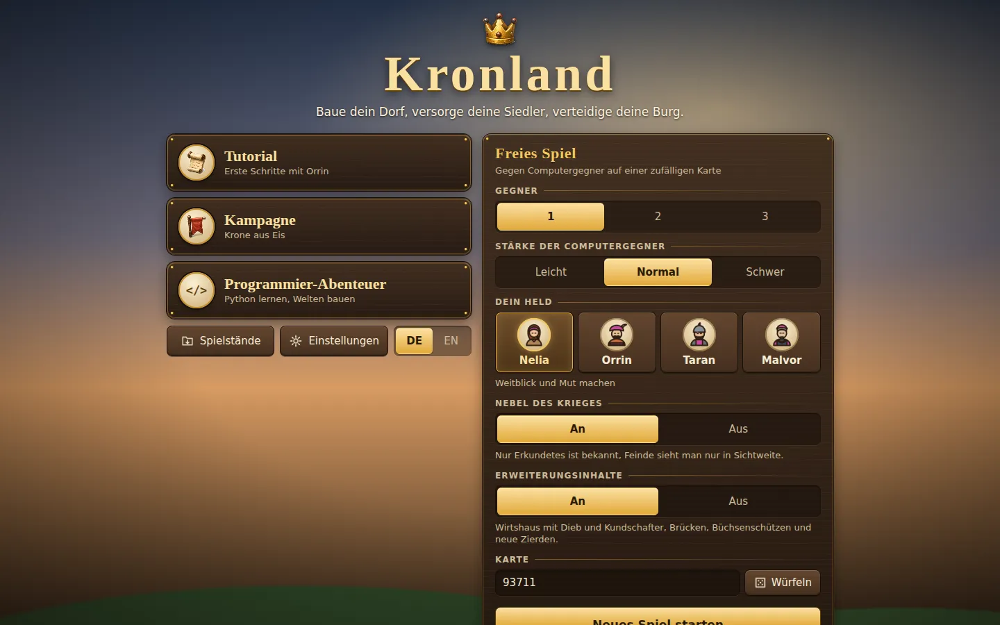 | 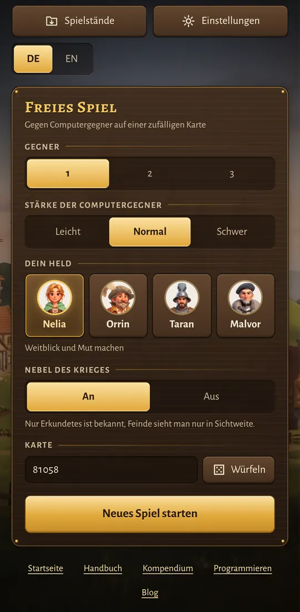 |
| Mission 1: Dorfälteste mit Ausrufezeichen | 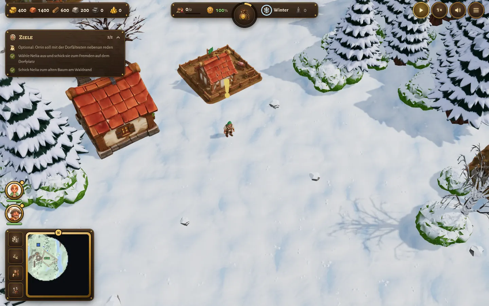 | 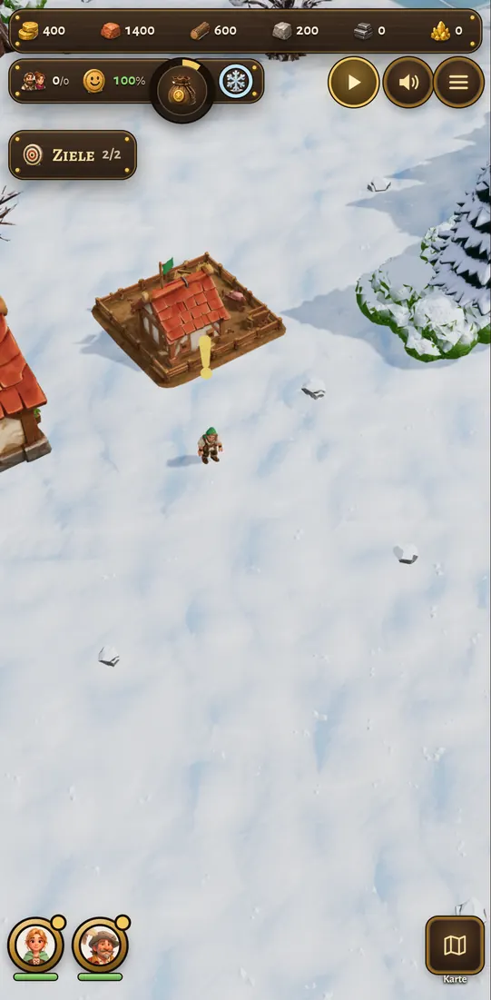 |
| Mission 4: Angebote (Söldner oder Leibeigene) | 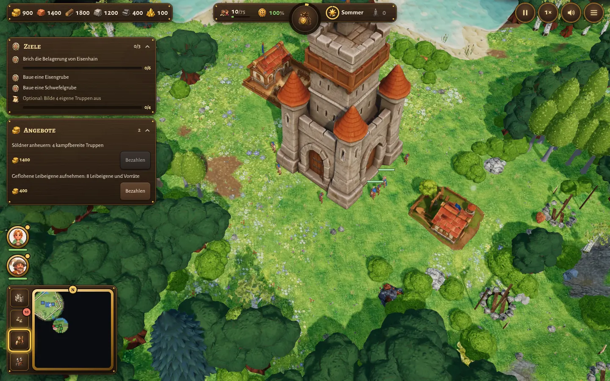 | 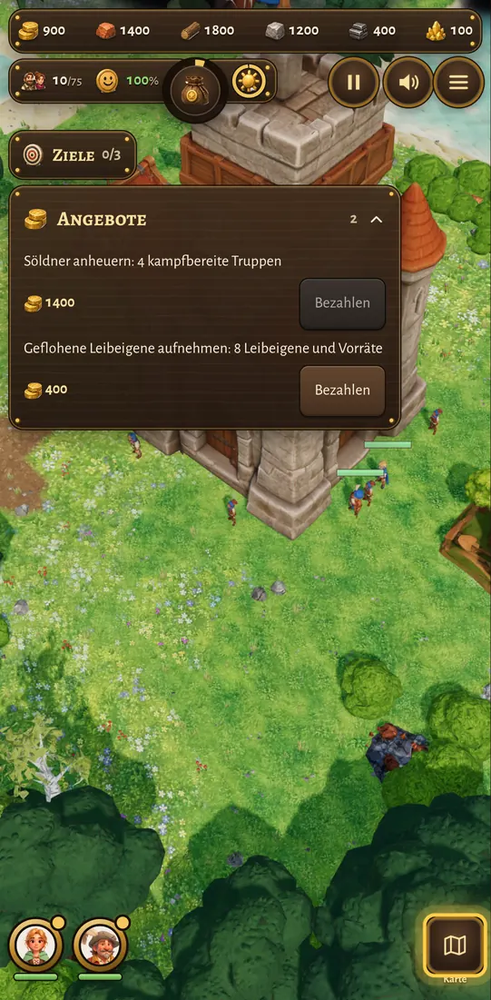 |
| Mission 3: Bergkamm mit Schlucht (zugefrorener Fluss) | 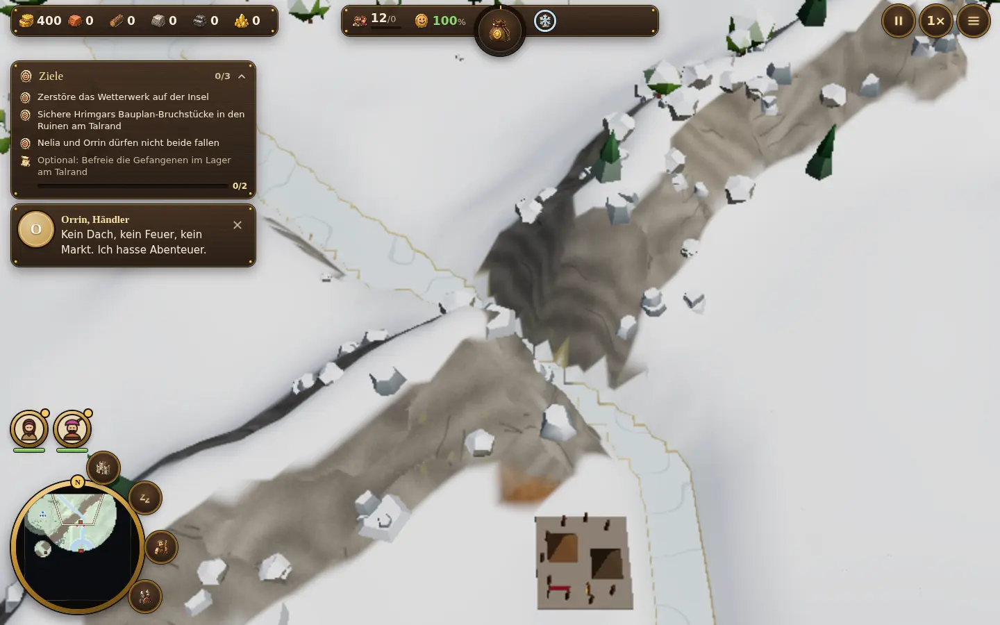 | 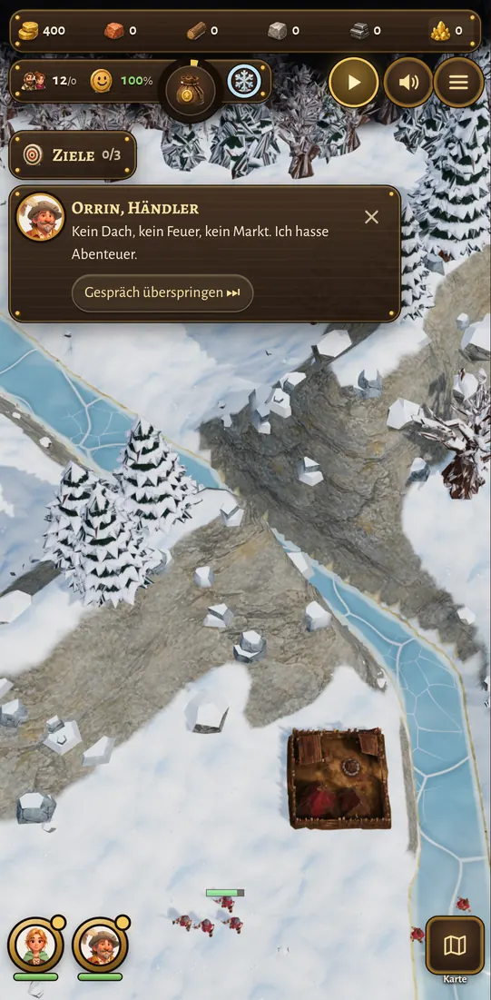 |
| Mission 3: Wetterwerk zerstört, die Uhr läuft bis zum Tauwetter | 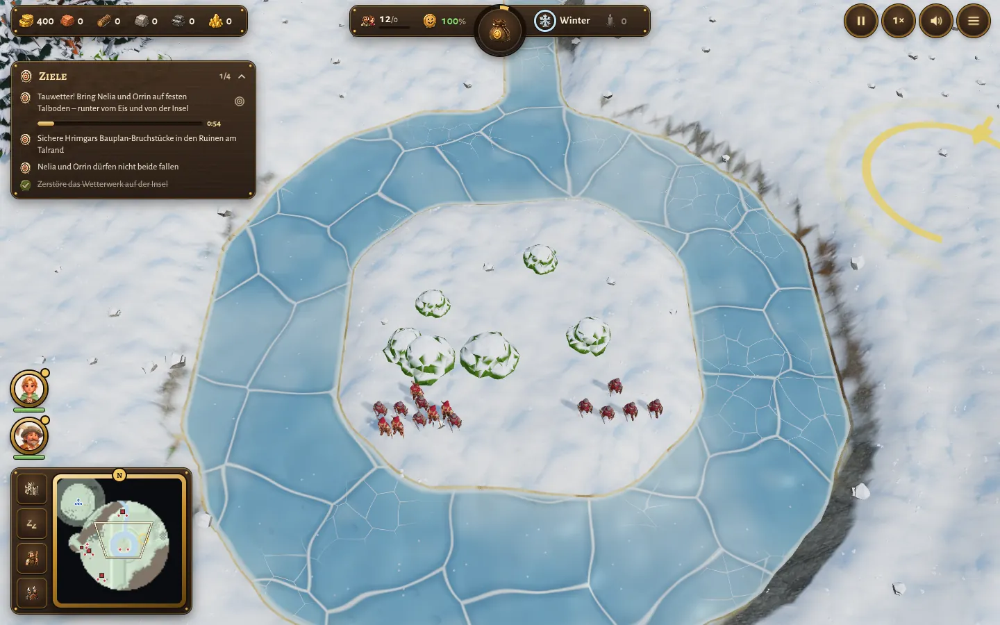 | 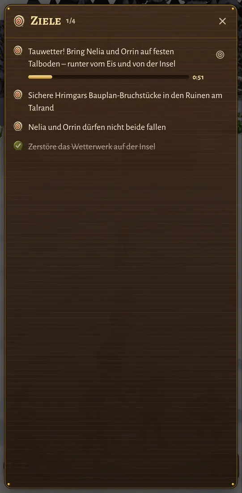 |
| Mission 6: Malvors Wetterkraftwerk auf der Werkinsel, Ladebalken im Nebenziel | 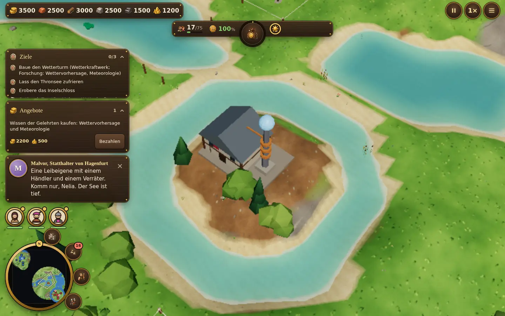 | 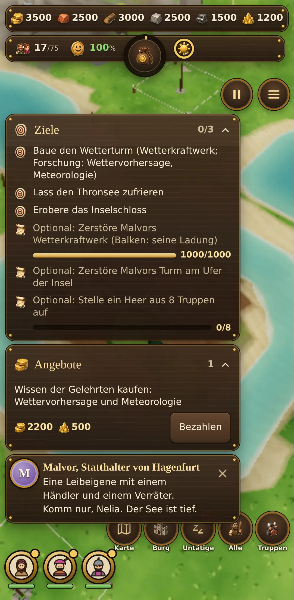 |
